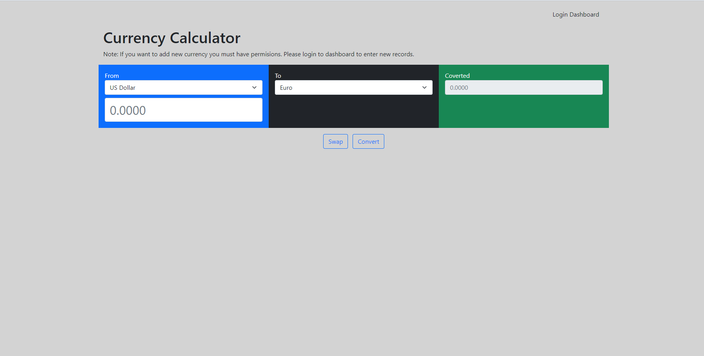

# currencycalc

This is a currency calculator web based.

[Created by Symfony 6.1 and embedded VueJS 2.6]

- Required php 8.1 or later
- Required SQLite php extention
- Required Composer 2.3.8 or later
- Required NodeJS 16.15.1 LTS Version


## Prepare for Windows Installation

The following packages are recommended to be installed on Windows if you are not a Linux user.

 - Latest XAMPP 8.1.6 / PHP 8.1.6
   https://downloadsapachefriends.global.ssl.fastly.net/8.1.6/xampp-windows-x64-8.1.6-0-VS16-installer.exe

 - Latest Composer 2.3.8
   https://getcomposer.org/Composer-Setup.exe

 - Latest LTS Version 16.15.1 of NodeJS 
   https://nodejs.org/dist/v16.15.1/node-v16.15.1-x64.msi


#### Basic configuration of Apache2.

You need to configure the Virtual Host to work properly for the project.

Here are the steps to do this:

- First open in an editor the file "C:\xampp\apache\conf\extra\httpd-vhosts.conf" 

- Next place the following code (copy/paste)

```
<VirtualHost *:80>
    # This domain just for reference.
    ServerName currencycalc.tld
    ServerAlias www.currencycalc.tld

    DocumentRoot "C:/xampp/htdocs/currencycalc/public"
    DirectoryIndex "/index.php"

    <Directory "C:/xampp/htdocs/currencycalc/public">
        AllowOverride None
        Order Allow,Deny
        Allow from All

        FallbackResource /index.php
    </Directory>

    ErrorLog "logs/currencycalc_error.log"
    CustomLog "logs/currencycalc_access.log" common
</VirtualHost>
```

Restart the Apache Server and then visit the web location "http://locahost"

**That was it. Congratulation!**

## Compile and run the project

After downloading the project locally or using git, enter the folder you created and follow the instructions below to compile and run the project.

#### Composer much be installed first.

```bash
$ composer install 
```

#### Second you need to install npm.

```bash
$ npm install
```

#### Building the project
```bash
$ npm run dev 
```

If everything went OK, you should be able to see the main page as well.




### Symfony CLI mode

You can also run the project with Symfony CLI if it is already installed. 

Running 
```bash
$ symfony serve 
```

#### You can read more about installation and configuration

[Installation guide](https://symfony.com/doc/current/setup.html)

[Download Symfony CLI](https://symfony.com/download)
 

**More about Server Installation**

If you don't have Symfony CLI installed, then follow the instructions below to run the project with Ngix or Apache2 according to your system and your needs.

[Apache2 & Ngix configuration](https://symfony.com/doc/current/setup/web_server_configuration.html)

## Login page

To access in dashboard you need authentication. 

A user is already created by default and stored in the database.

 - The username is "user"
 - The password is "user"


